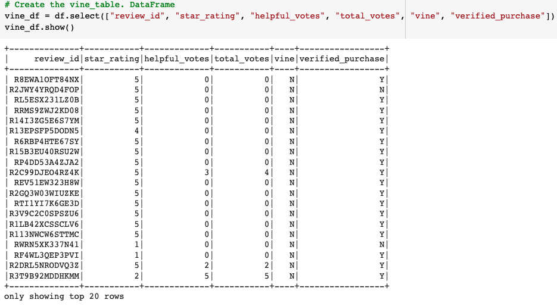
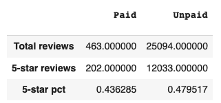

## Overview

This analysis explores a dataset containing non-paid and paid vine reviews for an Amazon baby product.

In the analysis, PySpark is used to perform the ETL process to extract the dataset, transform the data, connect to an AWS RDS instance, and load the transformed data into pgAdmin. The transformed data is then analyzed to determine if there is any bias toward favorable reviews from Vine members.

## Results

### The vine dataset

After reading the review dataset as a dataframe, a vine_df dataframe was created to hold relevant information. This vine_df dataframe was then further transformed to understand the data. The step by step transformation can be found in the Vine_Review_Analysis.ipynb file.

The main part of the transformation consisted in filtering for reviews that would be more likely to be helpful. Namely, reviews where:

- total_votes are greater than or equal to 20
- the helpful_votes/total_votes ratio is equal or greater than 50%

### Results

The results of this analysis are shown in the following image.

- There are 25,094 non-Vine (non paid user) reviews.
- There are 202 Vine user reviews with 5-stars.
- There are 12,033 non-Vine reviews with 5 stars.
- 44% of Vine reviews have 5 stars.
- 48% of non-Vine reviews have 5 stars

## Summary

There does not seem to be any positivity bias for reviews in the Vine program, as non-vine users have a higher % of 5-star reviews.

It would be interesting to conduct an additional analysis to review the number of total reviews, the number of 5 star reviews, and the 5 star % for verified purchase reviews vs non-verified purchase reviews.
